greenscreen
===========

### Introduction
Automated background removal of greenscreen images can be tricky sometime.

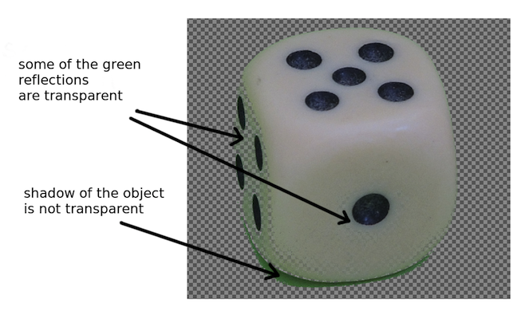
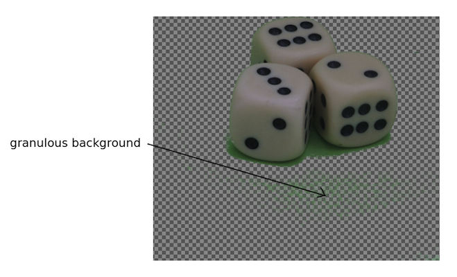

To solve these problems training a machinelearning model could be helpful.

### Setup example
For a proof of concept I produced some example greenscreen images using the
following setup.

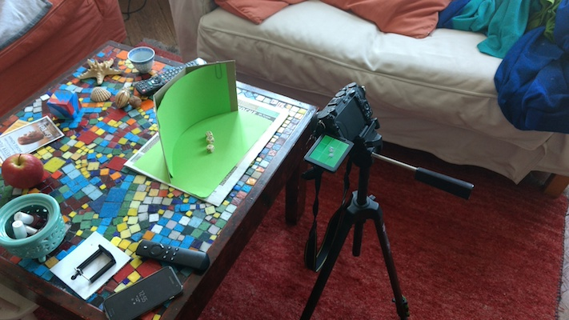

I did not take much care about light and othe environmental issues, as the plan
was to let the machinelearning software taking care of these problems.

The following images adress some of the expected problems.

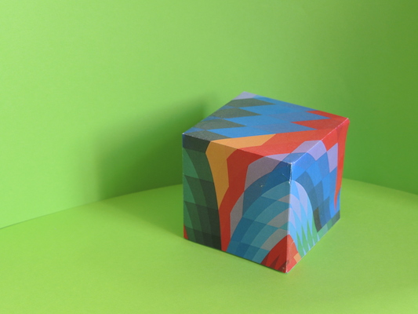

Object contains green.

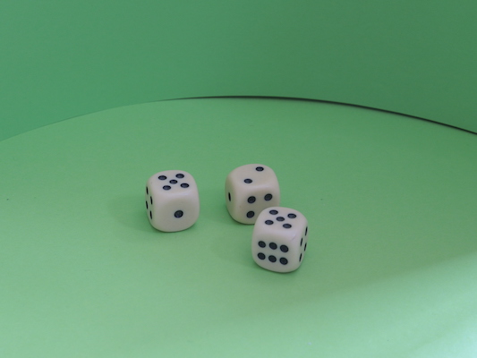

Green reflections on the objects

Dark shadows on the green surface

#### Small images 'img100'
In order to get the trainig and testing up and running the images where scaled
to a very small size (133 px x 100 px).

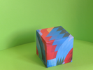

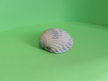

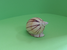

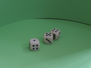

As a machinelearning model a feed forward neural net was choosen.

The net consists of 2646 input nodes, two hidden layers (1000, 100 nodes)
and one output layer comosed of one (output) node. Sigmoid activation functions where
choosen, as all the input and output values are between 0 and 1. For details see [model_a](doc/model_a.md)

For the creation of trainingdata the background of two of the images was
manually removed.

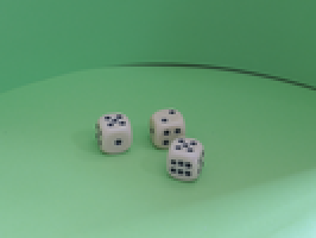
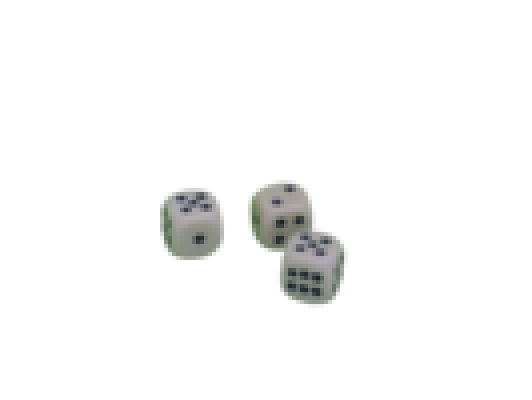

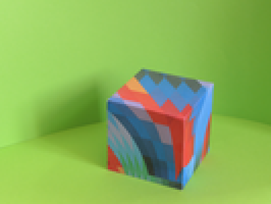
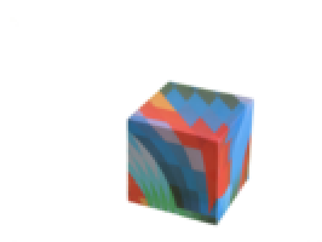

Then an input dataset was created as described in the graphics below

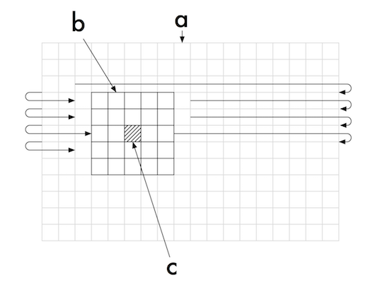

a) The image.

b) The actual pixel containing the label represented by its transparency.

c) The feature box for the actual pixel

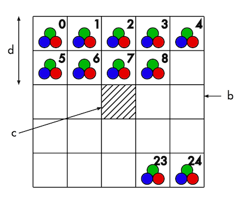

b) The actual pixel containing the label represented by its transparency.

c) The feature box for the actual pixel.

d) Delta. The maximal distance of features from the actual pixel.

The features are the RGB values of the pixels of the feature box

#### Results

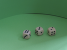
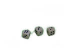

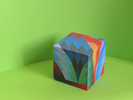
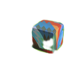

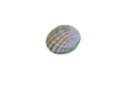

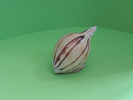
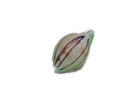

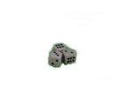

